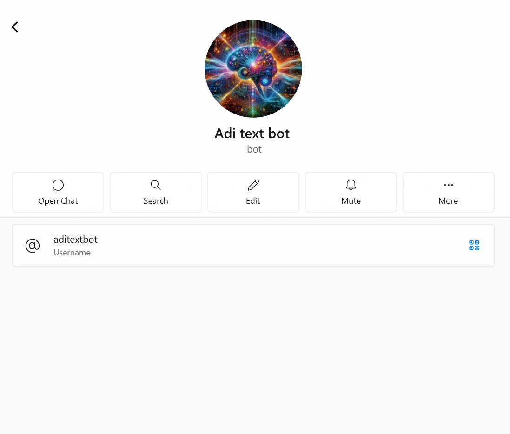
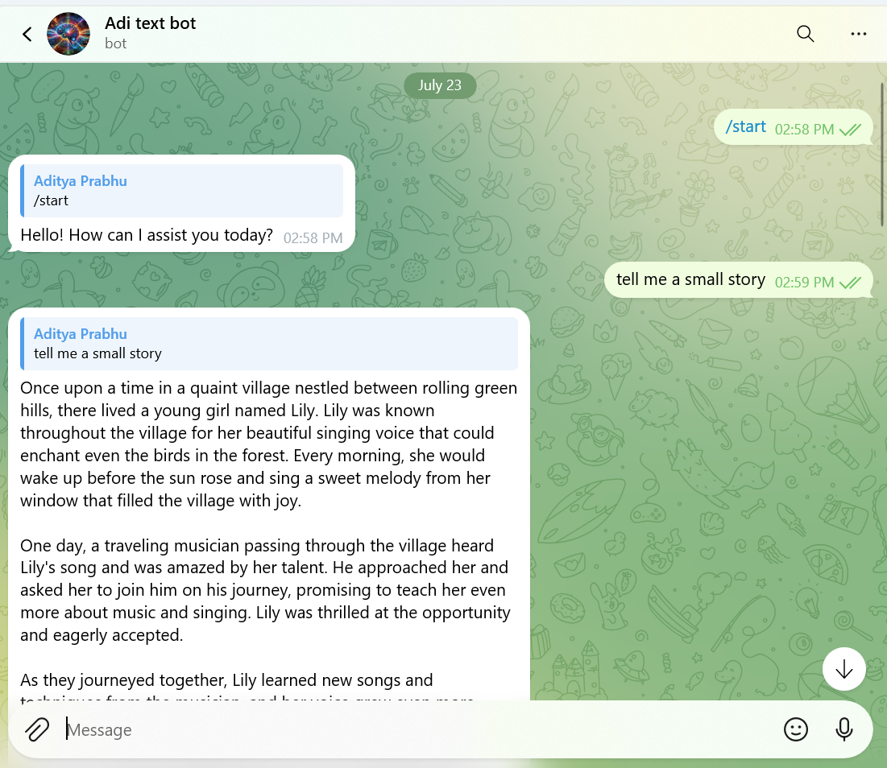
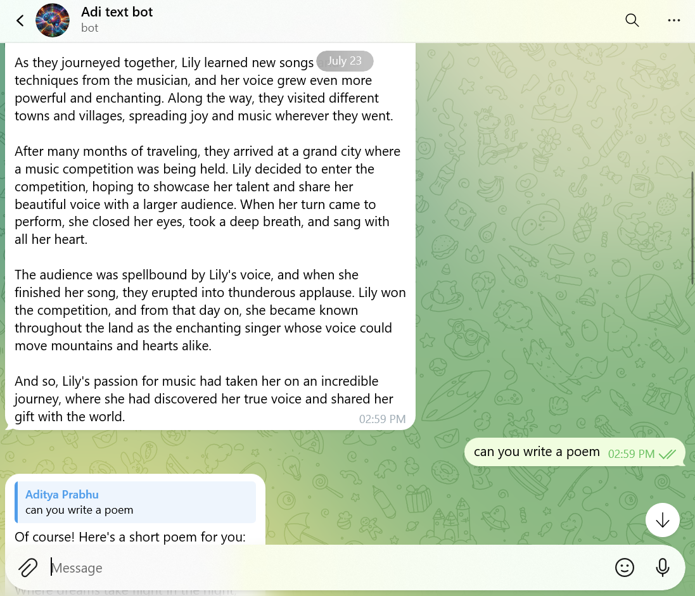
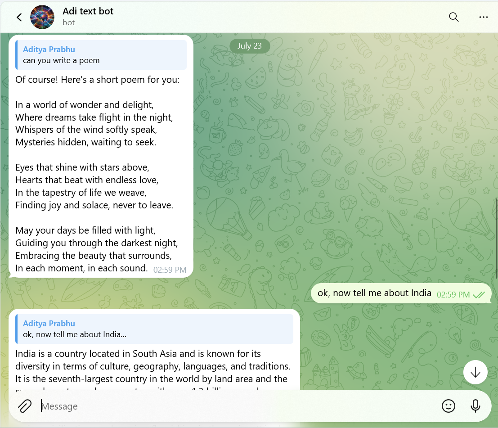
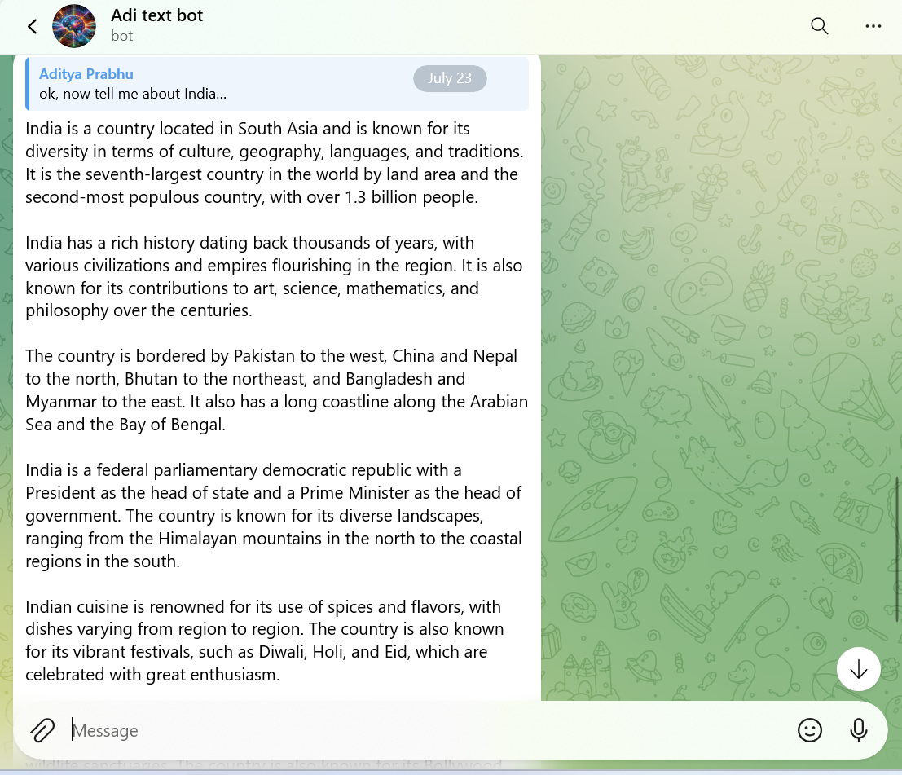

# Telegram AI Chat Bot
## (Adi Chatbot)

This project is a **Telegram chatbot built using Python** that integrates **OpenAI's language model** to provide intelligent and conversational responses to users.  
The bot interacts with users on Telegram and replies to their messages in real time.

---

## Features

- Conversational AI chatbot on Telegram
- Powered by OpenAI (GPT model)
- Built using `aiogram` for async Telegram handling

---

## Tech Stack

- **Programming Language:** Python
- **Telegram Framework:** aiogram
- **AI Model:** OpenAI API

---

## Screenshots

  
  
  

  

---

## Future Enhancements

- Conversation history memory
- Command-based interactions
- Multi-language support

---

## Author

**Aditya Prabhu**  
B.Tech – Robotics & Artificial Intelligence  
Nitte University

GitHub: [https://github.com/aditya-prabhu-udupi](https://github.com/aditya-prabhu-udupi)  
Portfolio: [https://aditya-prabhu-portfolio.netlify.app/](https://aditya-prabhu-portfolio.netlify.app/)
